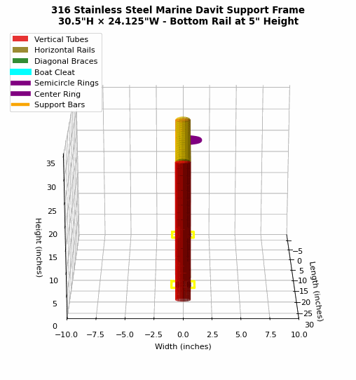

# 316 Stainless Steel Marine Davit Support Frame Generator

This project generates 3D CAD files for fabricating a marine-grade 316 stainless steel davit support frame with the following specifications:



## Frame Specifications
- **Two vertical tubes**: 30.5 inches tall, 1.375 inches outer diameter (0.095"-0.120" wall thickness)
- **Two horizontal tubes**: 24.125 inches long, 1.375 inches outer diameter (0.095"-0.120" wall thickness)
- **Four diagonal braces**: 12 inches long, 1.125 inches outer diameter (45° corner reinforcement)
- **Top horizontal tube**: Positioned at the top of both vertical tubes (30.5" height)
- **Bottom horizontal tube**: Positioned 5 inches from the bottom of the vertical tubes
- **6" Boat Cleat**: Low-profile deck cleat mounted on top center
- **316 SS Ring System**: 0.75" thick round ring split into semicircles on vertical tubes at 27.5" height
- **Support Bars**: Angled 6" bars with mounting plates for foundation attachment
- **Material**: 316 Stainless Steel (marine grade) for maximum corrosion resistance

## Engineering Application
This frame is designed to support a Roskelley Ollson fork davit system on a boat. The frame provides:
- **Pivot support** for davit rotation from upright to horizontal position
- **Structural reinforcement** with diagonal corner braces
- **Foundation mounting** via angled support bars with bolt plates
- **Rigging points** through semicircle ring system
- **Deck hardware** integration with low-profile cleat

## Usage

Generate all file formats:
```bash
# Generate DXF file (primary CAD format)
python metal_frame_generator.py

# Generate STEP and OBJ files (additional formats)
python metal_frame_step_generator.py

# Generate 3D visualization images
python visualize_frame.py

# Create rotating GIF animation
python create_rotating_gif.py
```

This will create multiple files:
- `stainless_steel_frame_3d.dxf` - Main DXF file for CAD software
- `stainless_steel_frame.step` - STEP file for 3D modeling
- `stainless_steel_frame.obj` - OBJ file for 3D visualization
- `stainless_steel_frame_visualization.png` - Static 3D rendering
- `frame_3d_rotation.gif` - Rotating 3D animation

## Generated File Features

The generated files include:

### DXF File Features
- **3D tube representations** with proper cylindrical geometry using 3DFACE entities
- **Organized layers** for different components (vertical tubes, horizontal tubes, braces)
- **Precise dimensions** and centerlines for fabrication reference
- **Material specifications** and welding notes
- **Compatible with AutoCAD 2010+** and most CAD software

### STEP File Features
- **Solid 3D models** for precise manufacturing
- **Parametric geometry** that can be modified in CAD software
- **Assembly structure** showing all components and their relationships
- **Material properties** embedded for analysis

### Visualization Features
- **Color-coded components** for easy identification
- **Multiple viewing angles** and transparent background options
- **Rotating GIF animation** showing complete 360° view
- **Detailed annotations** with specifications and dimensions

## Installation

1. Install the required dependencies:
```bash
pip install -r requirements.txt
```

## DXF File Features

The generated DXF file includes:

- **3D tube representations** with proper cylindrical geometry
- **Organized layers**:
  - `VERTICAL_TUBES` (Red) - The two 48" vertical supports
  - `HORIZONTAL_TUBES` (Yellow) - The two 24" horizontal rails
  - `CENTERLINES` (Gray, dashed) - Fabrication reference lines
  - `DIMENSIONS` (White) - Measurements and annotations
- **Precise dimensions** for fabrication
- **Material specifications** and notes
- **Welding points** clearly indicated

## CAD Software Compatibility

The DXF file is saved in AutoCAD 2010 format (R2010) for maximum compatibility with:
- AutoCAD
- SolidWorks
- Fusion 360
- FreeCAD
- LibreCAD
- And most other CAD/CAM software

## Fabrication Notes

- All dimensions are in inches
- Tube outer diameter: 2.000"
- Recommended material: 316 stainless steel for corrosion resistance
- Welded construction at all joints
- Consider adding gussets at joints for additional strength if needed

## File Structure

```
.
├── README.md                    # This file
├── requirements.txt             # Python dependencies
├── metal_frame_generator.py     # Main generator script
└── stainless_steel_frame_3d.dxf # Generated DXF file (after running script)
```