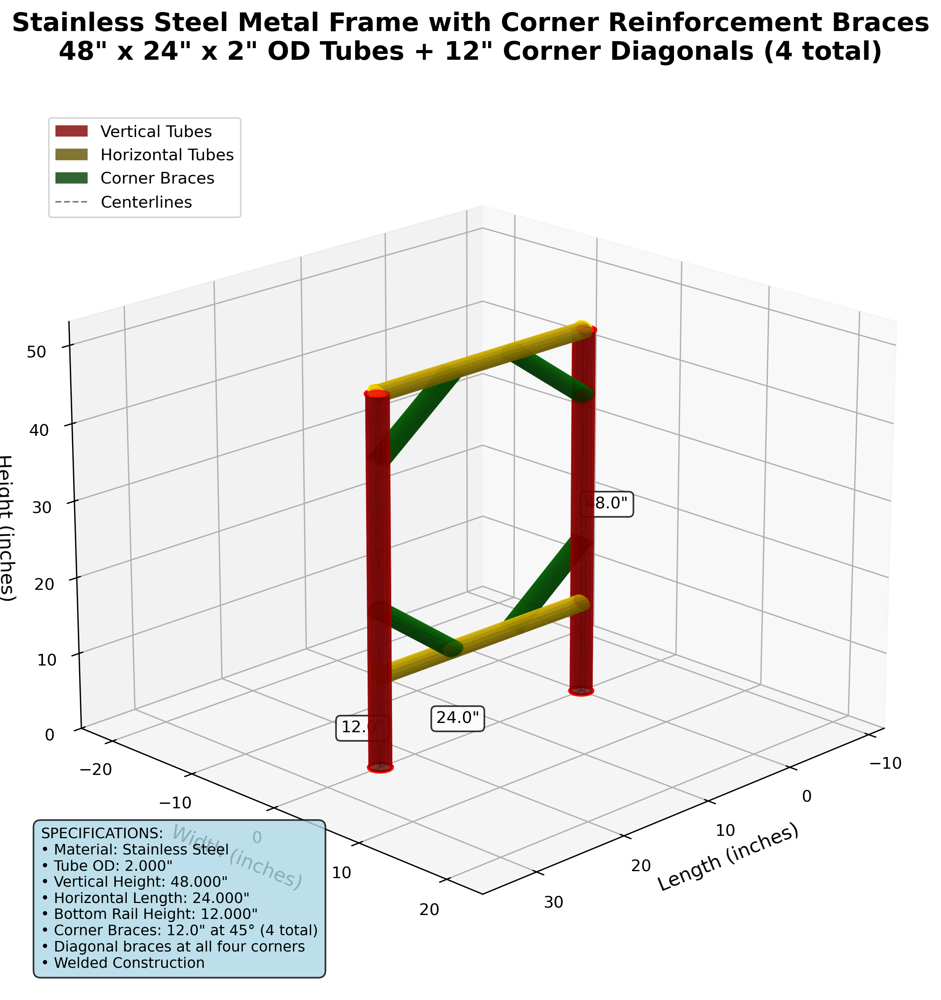

# Stainless Steel Metal Frame DXF Generator

This project generates a 3D DXF file for fabricating a stainless steel metal frame with the following specifications:

## Frame Specifications
- **Two vertical tubes**: 48 inches tall, 2 inches outer diameter
- **Two horizontal tubes**: 24 inches long, 2 inches outer diameter
- **Top horizontal tube**: Positioned at the top of both vertical tubes (48" height)
- **Bottom horizontal tube**: Positioned 12 inches from the bottom of the vertical tubes
- **Material**: Stainless Steel
- **Construction**: Welded joints

## 3D Visualization



*3D rendering of the stainless steel metal frame showing the complete structure with vertical supports and horizontal rails.*

## Installation

1. Install the required dependencies:
```bash
pip install -r requirements.txt
```

## Usage

Run the generator script:
```bash
python metal_frame_generator.py
```

This will create a file named `stainless_steel_frame_3d.dxf` in the current directory.

## DXF File Features

The generated DXF file includes:

- **3D tube representations** with proper cylindrical geometry
- **Organized layers**:
  - `VERTICAL_TUBES` (Red) - The two 48" vertical supports
  - `HORIZONTAL_TUBES` (Yellow) - The two 24" horizontal rails
  - `CENTERLINES` (Gray, dashed) - Fabrication reference lines
  - `DIMENSIONS` (White) - Measurements and annotations
- **Precise dimensions** for fabrication
- **Material specifications** and notes
- **Welding points** clearly indicated

## CAD Software Compatibility

The DXF file is saved in AutoCAD 2010 format (R2010) for maximum compatibility with:
- AutoCAD
- SolidWorks
- Fusion 360
- FreeCAD
- LibreCAD
- And most other CAD/CAM software

## Fabrication Notes

- All dimensions are in inches
- Tube outer diameter: 2.000"
- Recommended material: 316 stainless steel for corrosion resistance
- Welded construction at all joints
- Consider adding gussets at joints for additional strength if needed

## File Structure

```
.
├── README.md                    # This file
├── requirements.txt             # Python dependencies
├── metal_frame_generator.py     # Main generator script
└── stainless_steel_frame_3d.dxf # Generated DXF file (after running script)
```